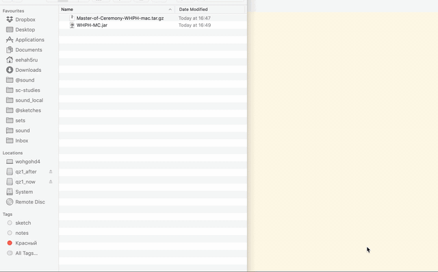
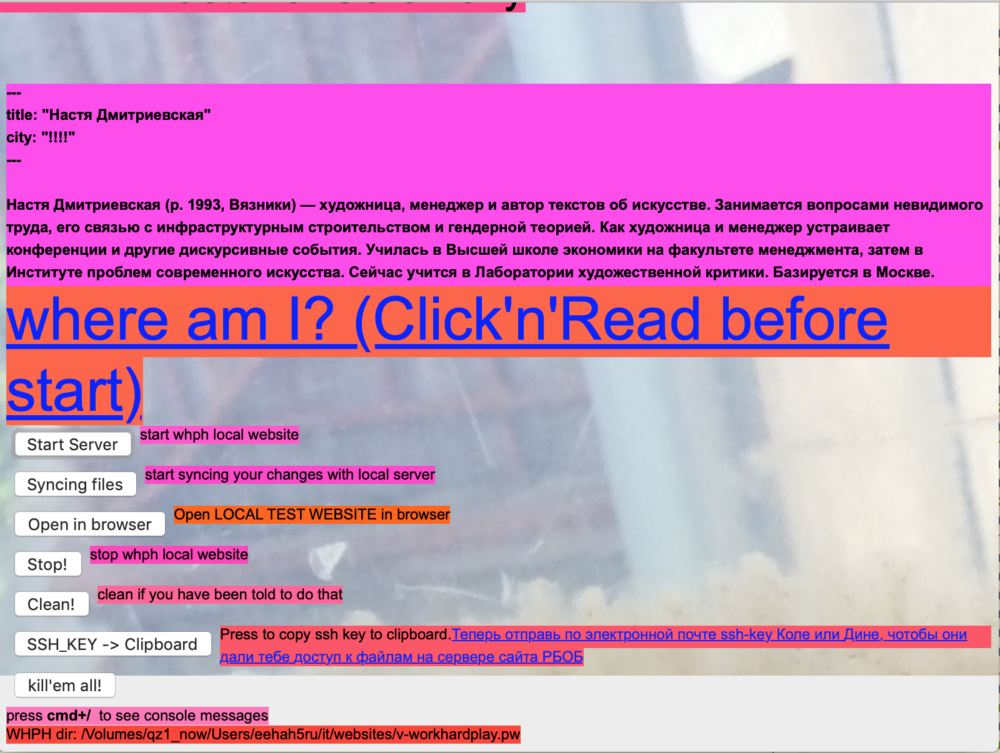

# WHPH Master of Ceremony

gui for editing/testing whph website content locally using vagrant to absctract from os

## User Guide

### Overview

WHPH-MC is an application dedicated to hide messy infrastructural things while you're editing  and *testing changes locally* whph pages. It's a *good practice* to test all your changes before pushing them into github repository. So all your collaborators won't fix your mistakes.

### Install requirements

- install [Virtual Box](https://www.virtualbox.org/wiki/Downloads).
- change VM folder to external drive in settings of VirtualBox if needed. It depends on the amount of free space on your internal hard drive.
- install [vagrant](https://www.vagrantup.com/docs/installation/).
- [download](https://www.oracle.com/technetwork/java/javase/downloads/index.html) and install latest JDK: extract archive and copy to `/Library/Java/JavaVirtualMachines`
- update JDK Home: `cd /Library/Java/JavaVirtualMachines; ln -s /Library/Java/JavaVirtualMachines/<name-of-jdk-archive>/Contents/Home`
- download the [latest release of the WHPH-MC app](https://github.com/eehah5ru/whp-pw-mc/releases). Copy *.app* file to the *Applications* folder.

### Starting WHPH-MC

Start the app as usual app. After a while a dialog will appear asking you to specify your working WHPH directory (that contains all files you're working on)

### Interface overview

#### Where am I -> Setup

Start this action only once just after installing all prerequisites andthe whph-mc app

#### Start server

Starting the local server where you can work on your changes. *New terminal window will be opened!* Please look at this new opened terminal window to check the status of the website. All errer messages will appear in this terminal window.

During starting process you can be asked to enter your mac os password. It's normal. Just enter your password.

#### Syncing files

Syncs your changes in website files with local server. So your changes will be visible on your local test website. *New terminal window will be opened!*

#### Open in browser

Opens you local copy of the whph website *in your browser*. 

#### Stop!

Stop all processes (local server and syncing files)

You can be asked to enter your mac os password. It's normal. Just enter your password.

#### Clean!

Clean local website data. Do it only if you've been notified to clean the data.

#### SSH_KEY -> Clipboard

Part of setup process. Follow the instructions.

#### kill'em all!

Press it at the end of work to be sure there are no any zombies around.

### Typical Workflow of making your changes in the website

##### Preparation

Open Github Desktop app. 

Fetch lates changes in current workin branch (`archive-17-18` now)

Check that there are no any conflicts. If there are any resolve them and commit your changes then push them to the github

Start your local whph server

- open WHPH-MC app
- Press **Start Server** button. Enter password if needed. Wait while server booting.
- Press **Syncing Files** to make your changes available on local whph server. Wait while files are being syncing.
- Press **Open in Browser** to visit local whph server in browser.

#### Working process

Make changes in whph website files you plan to do (in Atom editor). *Save edited file!*

Wait a bit to make changed files be reloaded by local server

Reload page in browser to test your changes

#### Finishing

Press **Stop!** to stop local server.

Close all terminal windows if teher are any.

Close WHPH-MC app.

### More Info

You can [read here a tutorial about git and github written for non-technicals](https://medium.com/crowdbotics/a-dead-simple-intro-to-github-for-the-non-technical-f9d56410a856)

## Development Guide

### dev requirements

install shoes4 using git. for details: https://github.com/shoes/shoes4

change `ruby-version` to latest `jruby`

add `fastimage` to shoes's `Gemfile`. It's needed to package.

We don't use project Gemfile because in this case the app building process is broken

- rvm
- jruby
- `gem install shoes -v 4.0.0.rc1`
- `gem install fastimage`
